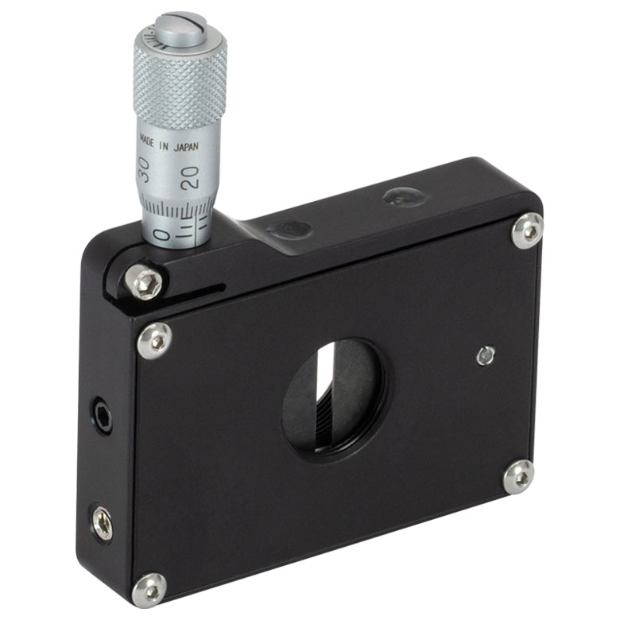
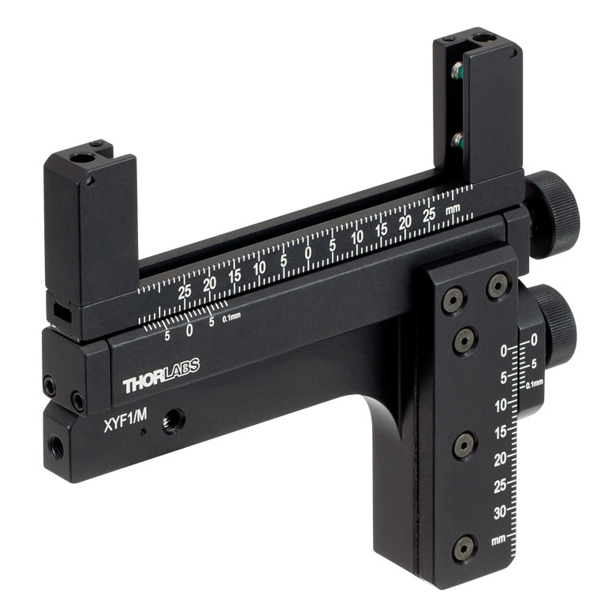

# Electrical-Mechanical
A key aspect of LabStream is the automation of lab components to enable precise remote control.

## Mechanical Components
### [VA100/M](https://www.thorlabs.com/newgrouppage9.cfm?objectgroup_id=1465&pn=VA100/M) (Slit Mount)

  

- Utilizes a micrometer to open/close the slit
- Mounted in front of [RSP1D/M](https://www.thorlabs.com/newgrouppage9.cfm?objectgroup_id=246&pn=RSP1D/M)

### [XYF1/M](https://www.thorlabs.com/newgrouppage9.cfm?objectgroup_id=5343&pn=XYF1/M) (Pattern Mount)

  

- Mounted with pattern filters made from micro-fabrication lab

## Steps of using MicroPython in Thonny IDE
Assuming Python (any version) is installed and set up already.
### 1. Download esptool
`pip install esptool`
`pip3 install esptool`
### 2. Erase ESP32
`esptool.exe --chip esp32 --port <port_name> erase_flash`
### 3. Download MicroPython firmware
`esptool.exe --chip esp32 --port <port_name> write_flash -z 0x1000 “address/path of .bin firmware file”`
